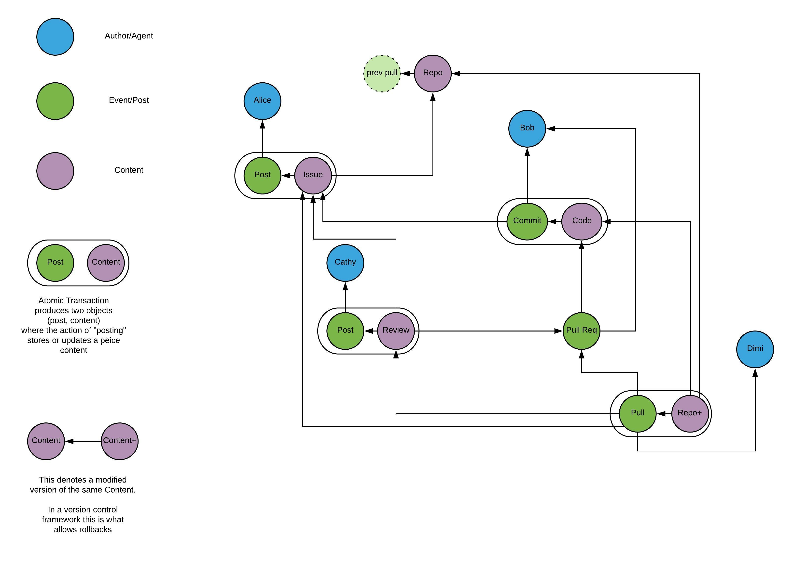
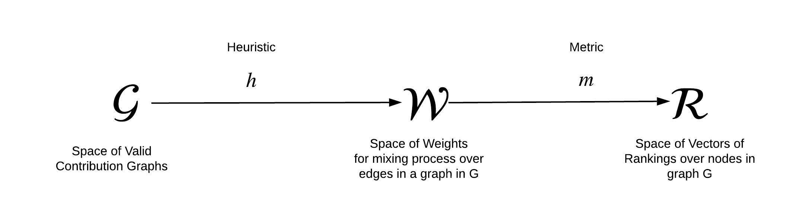
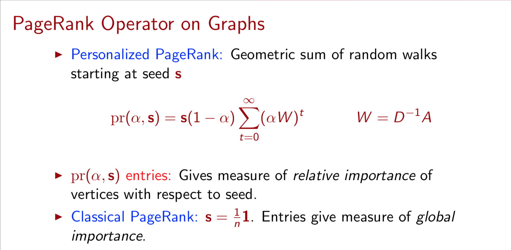
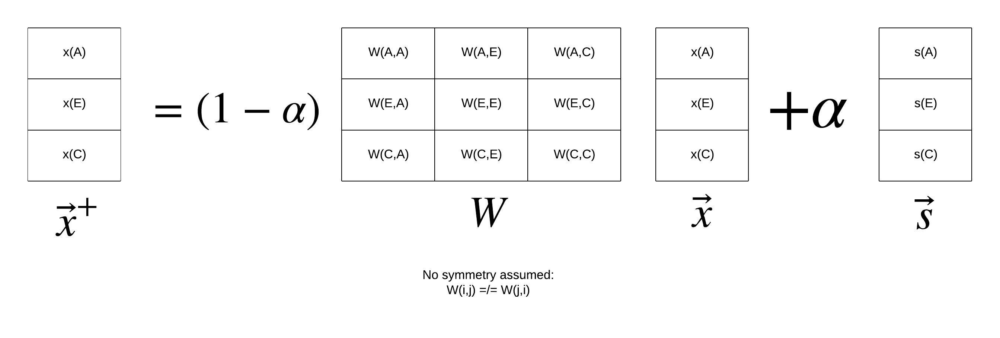
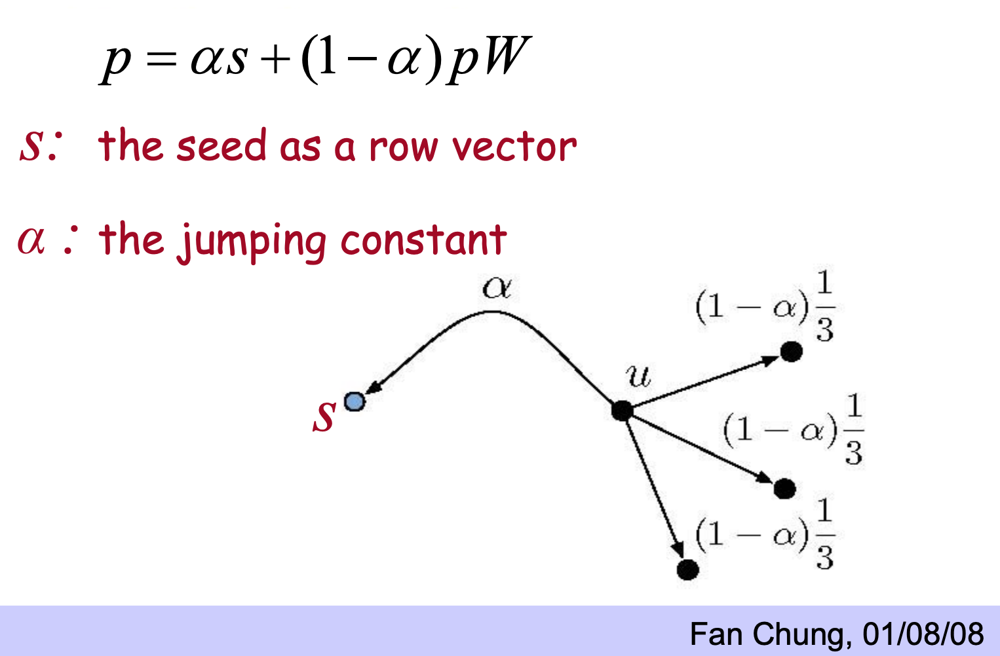
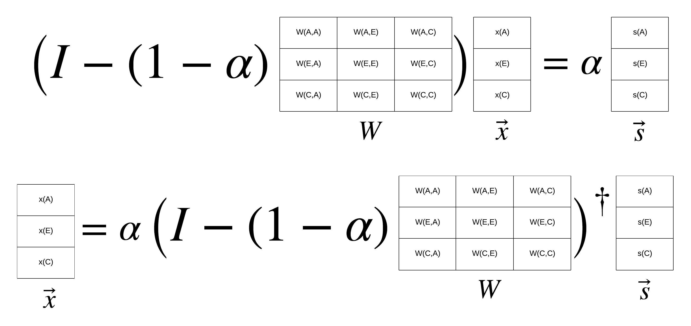

## Abstract

Source Cred requires a ranking algorithm for open source contributions that respects the underlying social process of credit attribution, accounting for relevance in both space and time. Here space refers to the network of interconnected authors and content and time refers to the process by which existing content is updated and new content is added. The PageRank algorithm measures relevance of nodes in a graph which is evolving in time, the approach of this research will be follow the derivation of the PageRank algorithm to recover an algorithm that can serve a similar function in the contribution graph.

## The Contribution Graph

The contribution graph is a distillation of data collected from existing source control data available through a combination of git scripts and github plugins. While the source data has a rich data model accounting for a wide range of contribution types ranging from issues to reviews to code, and much more, the fundamental structure has at least two distinct classes (or colors) of nodes: Authors and Content.

Unlike in the case of canonical PageRank, the desired rankings are less about the current state of the content but in fact focused on the growth of the network, that is the creation of more quality content. Though it is clear from canonical PageRank, just having a lot of links can be spammed so the mixing process on the network is a critical way discover the truly influential nodes. Unlike in canonical PageRank, the _pull_ events or changes to the current content network carry a lot of the information about relevance. In order to capture this second order effect an addition node class "event" is introduced into the graph model. Equipped with these three models it is possible to introduce a semantic definition of all valid contribution networks in terms of nodes and edges of different types. Here is a list of examples:

<table>
  <tr>
   <td><strong>Edge Type</strong>
   </td>
   <td><strong>From</strong>
   </td>
   <td><strong>To</strong>
   </td>
  </tr>
  <tr>
   <td>Citation
   </td>
   <td>Content
   </td>
   <td>Author
   </td>
  </tr>
  <tr>
   <td>Reference
   </td>
   <td>Content
   </td>
   <td>Content
   </td>
  </tr>
  <tr>
   <td>Dependency
   </td>
   <td>Content
   </td>
   <td>Content
   </td>
  </tr>
  <tr>
   <td>Identity
   </td>
   <td>Author
   </td>
   <td>Author
   </td>
  </tr>
  <tr>
   <td>Mentorship
   </td>
   <td>Author (mentee)
   </td>
   <td>Author (mentor)
   </td>
  </tr>
  <tr>
   <td>Authorship
   </td>
   <td>Event
   </td>
   <td>Author
   </td>
  </tr>
  <tr>
   <td>Publication
   </td>
   <td>Content
   </td>
   <td>Event
   </td>
  </tr>
</table>

The research process would involve specifying a formal semantic for valid contribution graphs so that "contribution graph" serves as a valid domain for a broad class of algorithms.

## From Graph Semantics to Rankings

Spectral ranking algorithms like canonical PageRank actually require more than just a graph to find rankings. While it is common knowledge that PageRank is an eigenvector of a graph, it is often overlooked that graphs do not have eigenvectors, graph processes have eigenvectors. Canonical PageRank is an eigenvector of mixing process determined by assuming an equal probability of taking any outbound link on a given web page, with an additional driving term indicating a probability alpha of "teleporting" to any webpage, at least when the seed vector is set to a uniform distribution. Personalized PageRank is constructed by substituting a local indicator function for the seed vector. My preferred way to think about canonical PageRank is as a sum of random walks starting from the seed vector.

This simple mixing process is an easy intuitive leap for the web of hyperlinks between pages but is not immediately clear what is its analogue in our contribution graphs.

In order to keep our multiclass PageRank operator general enough to iterate over the design and/or to allow many variations to be supported by a broader community of users, we introduce the concept of a **heuristic,** which is defined as any mapping **_h_** that takes a valid contribution graph and returns a set of edge weights that define transition probabilities for a random walk. The heuristic may have access to the edge types and thus may provide a highly contextual assignment of weights between nodes.

The variation above shows an in influence propagation process where the variable _x_ is a node dimensional vector and the matrix W=W(G) is the transition probability matrix for some contribution network G. In our case the logic for constructing the transition probabilities differs according to the edge type and potentially other required data available in any valid G.

Even given a heuristic which generated a weighted graph, there is not yet a unique ranking. The **metric _m_** is defined as the operation which maps a given view W and returns a ranking. Rankings on a valid graph is any non-negative vector over the nodes in a valid contribution network G.

In the case of the graph mixing process it is necessary to select both an alpha parameter and a seed vector s in order to get a unique ranking vector. The ranking vector is the fixed point of the mixing process. While it is not necessarily the best way to compute the resulting eigenvector, the most straightforward way to express the general metric is by directly stating the solution to the linear system of equations using a pseudo-inverse operator, as shown below. (Note as formulated the matrix is positive semidefinite and thus invertable so an inverse operator would suffice.)

Under this framing the author rank is the subset of x denoted x(A) and the content rank is the subset x(C) for any seed vector. Given our desire to construct a timely ranking, one metric to consider is the ranking determined by setting both s(A) and S(C) to zero and only seeding the events nodes. Furthermore, events preceding a particular cutoff time may be excluded from the seeding vector and other logic applied to data in the contribution graph may be applied to determine the seed vectors. It is also possible to seed the process using a cohort of trusted authors. It is part of the "metric" algorithm design problem to choose a function s=f(G); experimentation is merited to determine how best to tune choices the function s=f(G) to achieve the desired properties of the metric.

The multiclass pagerank approach presented is not an algorithm design, but is rather a framework for defining a large class of algorithms which share the fundamental properties of pagerank including the structure of its derivation as a graph mixing process, but leaves key decisions open for exploration and tuning.

Authors:

The MultiClass PageRank algorithm was derived by David Sisson and Michael Zargham of BlockScience for the purpose of collaborating with the Source Cred team, and as part of broader research effort on the measurement of digital labor using network science mathematics. David is computational neuroscience PhD with 20 years of experience as a software and data systems architect. Michael Zargham is a systems engineering PhD with specialization network optimization and control.

References Stored [Here](/references/)
